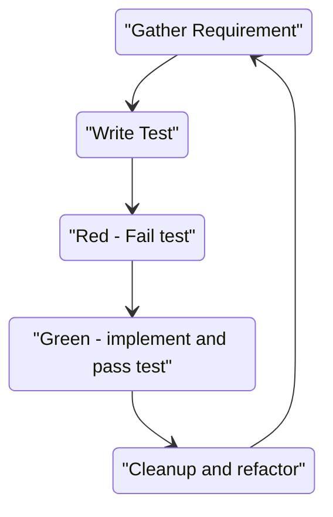

# FizzBuzzKata
FizzBuzz Coding Kata in C++ using CMake and [Catch2](https://github.com/catchorg/Catch2) as test runner

(See below for building and running the tests.)

# The TDD Cycle




# Your Task / Requirements Round 1

* Write a program that prints one line for each number from 1 to 100
* Usually, just print the number itself.
* For multiples of three print "Fizz" instead of the number
* For the multiples of five print "Buzz" instead of the number
* For numbers that are multiples of both three and five print "FizzBuzz" instead of the number
* For numbers that have the same digits (e.g. 11, 22, 33 ...) and are either Fizz, Buzz or Fizzbuzz  print "double" before the string

## Requirements Round 2

Tackle these once you completed Round 1

* The program should be able to handle any range of numbers up to std::numeric_limits<int>::max()
* For negative numbers print "negative" before the string
* For numbers that are divisible by 7 print "Bang" instead of the number
* "Bang" should be printed After "Fizz" and "Buzz" or "FizzBuzz"
* For numbers that have the same digits print "double", "triple", "quadruple", "quintuple", "sextuple", "septuple", "octuple", "nonuple", "decuple" before the string

## Requirements 3

* Modify the program so it only prints "double", "triple" or "many" for numbers with the same digits
* For numbers that are divisible by 11 print "Bong" instead of the number
* "Bong" should be printed before "Bang" and "Buzz" but after "Fizz" except for "FizzBuzz" and "FizzBuzzBang" where it goes at the end


# Requirements

## Building & Running the Tests

### Building

```bash

cmake -S . -B build 
cmake --build ./build
```

or 
```bash
cmake -S . -B build
cd build
make
```

### running the tests

```bash
cd build 
ctest --output-on-failure
```

or 

```bash
cmake --build ./build --target test
```


