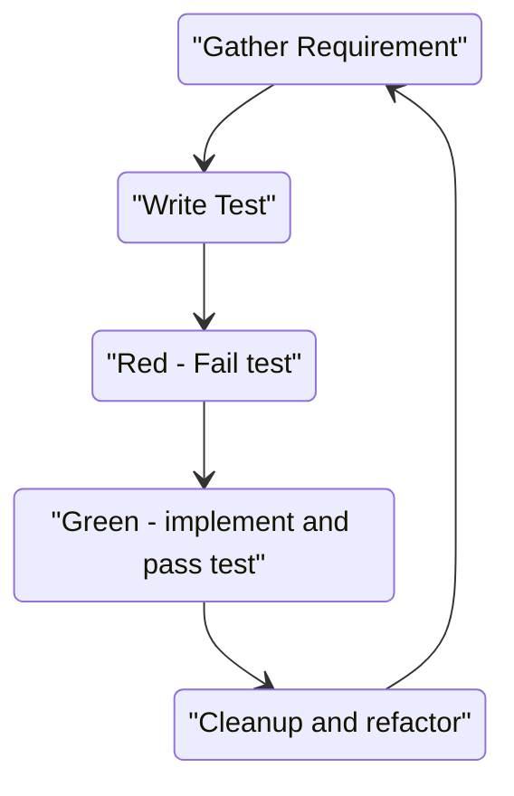

# FizzBuzzKata
FizzBuzz Coding Kata in C++ using CMake and [Catch2](https://github.com/catchorg/Catch2) as a test runner. 
(See below for building and running the tests.)


In this repo is a program that prints one line for each number from 1 to 100. Unfortunately, the coder that started the project went on to become a successful potato farmer and swore to never touch a keyboard again. However, the code they left behind is not working. Please help us to fix it. Please be advised that we require 100% test coverage for this project.

**Note:** This is a TDD Kata. You should start by writing a test that fails. Then write the code to make the test pass. Then refactor the code. Then write the next test. Start with Requirements Round 1 and once they are covered move on to Requirements Round 2 and Requirements 3.


## Requirements Round 1

Your task is to write one or more functions that take a number as an argument and returns a string 

## Requirements for the function Round 1

* Usually, just print the number itself. (i.e "0")
* For multiples of three print "Fizz" instead of the number
* For the multiples of five print "Buzz" instead of the number
* For numbers that are multiples of both three and five print "FizzBuzz" instead of the number
* For numbers that have the same digits (e.g. 11, 22, 33 ...) and are either "Fizz", "Buzz" or "FizzBuzz", print "double" before the string

## Requirements Round 2
<detail>
<summary>
Tackle these once you completed Round 1 (Click to expand)
</summary>
<details>

* The program should be able to handle any range of numbers up to std::numeric_limits<int>::max()
* For negative numbers print "negative" before the string
* For numbers that are divisible by 7 print "Bang" instead of the number
* "Bang" should be printed after "Fizz" and "Buzz" or "FizzBuzz"
* For numbers that have the same digits print "double", "triple", "quadruple", "quintuple", "sextuple", "septuple", "octuple", "nonuple", "decuple" before the string
</details>

## Requirements 3

<detail>
<summary>
Tackle these once you completed Round 1 (Click to expand)
</summary>
<details>

* Modify the program so it only prints "double", "triple" or "many" for numbers with the same digits
* For numbers that are divisible by 11 print "Bong" instead of the number
* "Bong" should be printed before "Bang" and "Buzz" but after "Fizz" except for "FizzBuzz" and "FizzBuzzBang" where it goes at the end
* When passing 0 the program should exit with a non-zero exit code

</details>
## Building & Running the Tests

## Building

For running in Visual Studio Code I suggest using the following extensions: 
* [CMake Tools](https://marketplace.visualstudio.com/items?itemName=ms-vscode.cmake-tools) extension.
* [Test Explorer UI](https://marketplace.visualstudio.com/items?itemName=hbenl.vscode-test-explorer) and the [CMake Test Explorer](https://marketplace.visualstudio.com/items?itemName=fredericbonnet.cmake-test-adapter)

```bash

cmake -S . -B build 
cmake --build ./build
```

or 
```bash
cmake -S . -B build
cd build
make
```

### running the tests

```bash
cd build 
ctest --output-on-failure
```

or 

```bash
cmake --build ./build --target test
```

# The TDD Cycle

